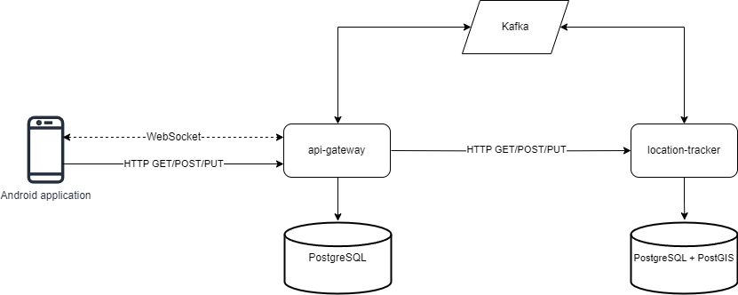
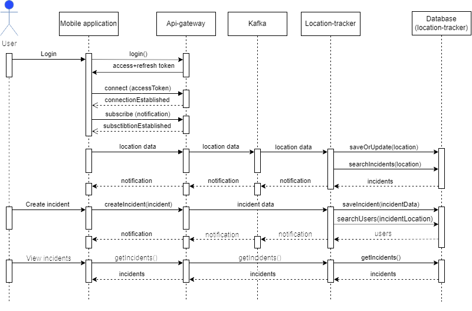

# Дипломная работа

## Мобильное приложение для фиксации происшествий и информирования о них (Сервер)
> Автор: Махмутов Адель Наилевич  
telegram: @Vodypep  
Ссылка на клиентскую часть: https://github.com/Adelbas/incidents-tracker-android

### Запуск приложения
1. Перейдите в директорию проекта
2. Соберите jar файл приложения при помощи команды: `./gradlew bootJar`
3. Запустите docker-compose файл при помощи команды: `docker-compose up`

### Архитектура системы

### Описание решения
Для написания программы использовался следующий стек технологий:
* Java
* Spring Boot (Web, Data Jpa, Security, WebSocket)
* JWT
* Liquibase
* PostgreSQL
* PostGIS

Все используемые библиотеки находятся в файле [libs.versions.toml](gradle/libs.versions.toml).  
Проект состоит из трёх основных модулей: api-gateway, location-tracker, common. Первые два являются сервисами, а модуль common является общим модулем для api-gateway и location-tracker, в нём хранится структура сообщений, которые передаются по Kafka между сервисами.  
В обоих модулях в папке [changelog](location-tracker/src/main/resources/db/changelog) содержатся sql скрипты миграций, которые используются при помощи liquibase для создания таблиц в базе данных.

### Диаграмма взаимодействия пользователя с системой
